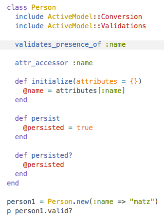
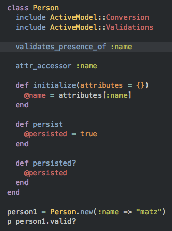

# NexT

> NexT是一款高质量简洁的 [Hexo](http://hexo.io)主题，她经过精心雕琢而来。


[在线预览](http://notes.iissnan.com) |  [English Documentation](README.en.md)


## 预览

[桌面设备预览](screenshots/desktop.png)


## 安装

1. 从`Github`下载

        $ git clone https://github.com/iissnan/hexo-theme-next themes/next

2. 将`_config.yml`中的`theme`字段设置为`next`

        theme: next

## 更新

```
cd theme/next
git pull
```


## 特性

### 英语/简体中文双语支持

> 默认语言是英文
> 编辑站点的`_config.yml`，将`language`字段更改为`zh-Hans`来启用中文

```
language: zh-Hans
```

### 多说评论支持

> 编辑站点的`_config.yml`，添加`duoshuo`字段，设置如下

```
duoshuo:
  enable: true
  shortname: duoshuo-shortname
```

### 标签云页面

> 添加一个标签云页面，并在菜单中显示标签云链接。

- 新建一个页面，命名为`tags`。命令如下：

        hexo new page "tags"

- 编辑刚新建的页面，将页面的类型设置为`tags`，主题将自动为这个页面显示标签云。

        title: All tags
        date: 2014-12-22 12:39:04
        type: "tags"

- 在菜单中添加链接。编辑主题的`_config.yml`，添加`tags`到`menu`中，如下:

        menu:
          home: /
          archives: /archives
          tags: /tags


### RSS链接

> 显示feed链接

打开主题的`_config.yml`中，将 `rss`字段设置为：

1. `rss: false`，这将会禁用Feed链接。
2. `rss:  `，当值为空的时候，默认会使用站点的Feed链接。在此之前需要使用[hexo-generator-feed](https://github.com/hexojs/hexo-generator-feed) 插件生成feed。

    依照`hexo-generator-feed`插件的安装说明进行feed生成，当配件配置完毕后，主题将自动显示feed链接。

3. `rss: http://your-feed-url`，指定特定的链接地址，适用于已经烧制过feed的情形。


### About页面与菜单链接

> 新建 关于 页面

新建一个`about`页面：

```
hexo new page "about"
```

菜单显示`About`链接，在主题设置中将`menu`中`about`前面的注释去掉即可。

```
menu:
  home: /
  archives: /archives
  tags: /tags
  about: /about
```

### 内置5款代码高亮主题

NexT 使用 [Tomorrow Theme](https://github.com/chriskempson/tomorrow-theme) 作为代码高亮，共有5款主题供你选择。
默认使用的是白色的`normal`，以下是`normal` 与 `night` 的预览：




请打开[Tomorrow Theme](https://github.com/chriskempson/tomorrow-theme)查看更多主题。

## 主题配置

NexT 拥有少许的配置

```
# 菜单配置
menu:
  home: /
  archives: /archives
  tags: /tags
  #about: /about

# Favicon
favicon: /favicon.ico

# 代码高亮主题
# available: normal | night | night eighties | night blue | night bright
highlight_theme: normal

# Fancybox - 用于显示照片组
fancybox: true

# 指定站点建立时间
since: 2013
```

## 浏览器支持


## 贡献

接受各种形式的贡献，包括不限于提交问题与需求，修复代码。等待您的`PR`。


## TODO

- [x] Using Swig instead of jade.
- [x] Using SCSS instead of stylus (depends?).
- [x] Rewrite link post related stuffs (Breaking changes).
- [x] Redesign pagination for mobile devices.
- [x] Support category.(Won't support).
- [x] Support gallery posts.
- [x] Make PAJAX and NProgress as optional. (Removed, conflicts with fancybox)
- [x] Add a feed link.
- [x] Refactor.
- [x] i18n.
- [x] How to use this theme.
- [x] Publish as a bower package.
- [ ] Home page.


[![hexo-image]][hexo-url]
[![bower-image]][bower-url]
[![jquery-image]][jquery-url]

[hexo-image]: http://img.shields.io/badge/Hexo-2.4+-2BAF2B.svg?style=flat-square
[hexo-url]: http://hexo.io
[bower-image]: http://img.shields.io/badge/Bower-*-2BAF2B.svg?style=flat-square
[bower-url]: http://bower.io
[jquery-image]: https://img.shields.io/badge/jquery-1.9-blue.svg?style=flat-square
[jquery-url]: http://jquery.com/