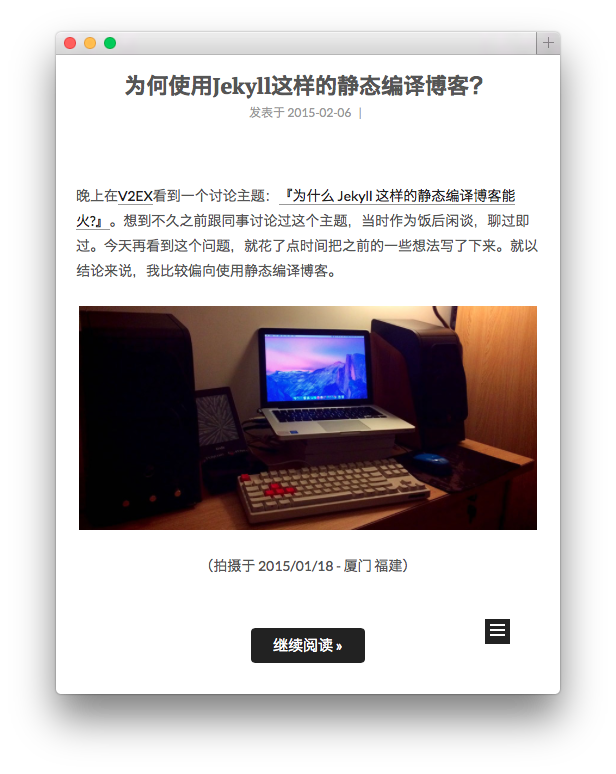
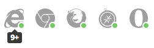

# NexT

> NexT is a high quality elegant [Hexo](http://hexo.io) theme. It is crafted from scratch, with love.


[Live Preview](http://notes.iissnan.com)  |  [中文文档](README-zh.md)

## Screenshots

[Desktop Preview](screenshots/desktop.png) | [Mobile Preview](screenshots/mobile.png)





## Installation

1. Get it from GitHub

        $ git clone https://github.com/iissnan/hexo-theme-next themes/next

2. Add it to `_config.yml`

        theme: next


## Update

```
cd theme/next
git pull
```

## Features

### English/Simplified Chinese language support.

> Default language is English.
> Set `language` field as following in site `_config.yml` to change to Chinese.

```
language: zh-Hans
```

### DuoShuo comment support.

> Add `duoshuo` field to site `_config.yml`. For instance

```
duoshuo:
  enable: true
  shortname: duoshuo-shortname
```


### Tags page.

> Add a tags page contains all tags in your site.

- Create a page named `tags`

        hexo new page "tags"

- Edit tags page, set page type to `tags`.

        title: All tags
        date: 2014-12-22 12:39:04
        type: "tags"

- Add `tags` to theme `_config.yml`:

        menu:
          home: /
          archives: /archives
          tags: /tags

### Feed link.

> Show a feed link.

This feature rely on [hexo-generator-feed](https://github.com/hexojs/hexo-generator-feed) plugin, you should install it first.
Follow the installation instruction in the plugin's README. After the configuration is done for this plugin, the feed link is ready too.


## Configuration

NexT comes with few configurations.

```

# Menu configuration.
menu:
  home: /
  archives: /archives

# Favicon
favicon: /favicon.ico

# Code highlight theme
# available: normal | night | night eighties | night blue | night bright
highlight_theme: normal

# Fancybox for image gallery
fancybox: true

# Specify the date when the site was setup
since: 2013

```

## Browser support




## TODO

- [x] Using Swig instead of jade.
- [x] Using SCSS instead of stylus (depends?).
- [x] Rewrite link post related stuffs (Breaking changes).
- [x] Redesign pagination for mobile devices.
- [x] Support category.(Won't support).
- [x] Support gallery posts.
- [x] Make PAJAX and NProgress as optional. (Removed, conflicts with fancybox)
- [x] Add a feed link.
- [x] Refactor.
- [x] i18n.
- [x] How to use this theme.
- [x] Publish as a bower package.
- [ ] Home page.

## Contributing

Contribution is welcome, feel free to open an issue and fork. Waiting for your pull request.

[![hexo-image]][hexo-url]
[![bower-image]][bower-url]
[![jquery-image]][jquery-url]

[hexo-image]: http://img.shields.io/badge/Hexo-2.4+-2BAF2B.svg?style=flat-square
[hexo-url]: http://hexo.io
[bower-image]: http://img.shields.io/badge/Bower-*-2BAF2B.svg?style=flat-square
[bower-url]: http://bower.io
[jquery-image]: https://img.shields.io/badge/jquery-1.9-blue.svg?style=flat-square
[jquery-url]: http://jquery.com/